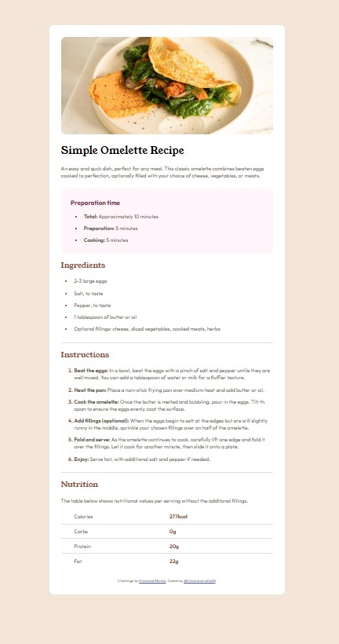

# Frontend Mentor - Recipe page solution

This is a solution to the [Recipe page challenge on Frontend Mentor](https://www.frontendmentor.io/challenges/recipe-page-KiTsR8QQKm). Frontend Mentor challenges help you improve your coding skills by building realistic projects. 

## Table of contents

- [Overview](#overview)
  - [The challenge](#the-challenge)
  - [Screenshot](#screenshot)
  - [Links](#links)
- [My process](#my-process)
  - [Built with](#built-with)
  - [What I learned](#what-i-learned)
  - [Continued development](#continued-development)
- [Author](#author)

## Overview

### The challenge

The challenge was to build a simple and clean omelette recipe page that matches the provided design as closely as possible. The goal was to use semantic HTML and CSS to recreate the layout, style the different sections consistently, and ensure the page looks good on different screen sizes.

### Screenshot

### Links

- Solution URL: (https://www.frontendmentor.io/solutions/omelette-recipe-using-html-and-css-9twxK-xoT9)
- Live Site URL:(https://vincentcornello20.github.io/frontendmentor-recipe-page/)

## My process

### Built with

- Semantic HTML5 markup
- CSS custom properties
- Flexbox
- Google Fonts

### What I learned

This was my first time completing a project entirely on my own, and it helped me understand how to structure a page using semantic HTML and style it effectively with CSS. I learned how to work with custom properties, manage spacing between different sections, and add consistent visual separators. One specific thing I was proud to learn was how to change the color of list markers using CSS, which gave the design a more polished and customized look.

### Continued development

Going forward, I want to focus on improving how I structure my HTML and CSS for larger projects. For this challenge a simple setup was enough, but in more complex layouts I’ll need to use more classes and IDs to keep everything organized and scalable. I also want to refine my CSS organization and continue practicing techniques that make my stylesheets cleaner and easier to maintain.

## Author

- Frontend Mentor - [@Vincentcornello20](https://www.frontendmentor.io/profile/Vincentcornello20)